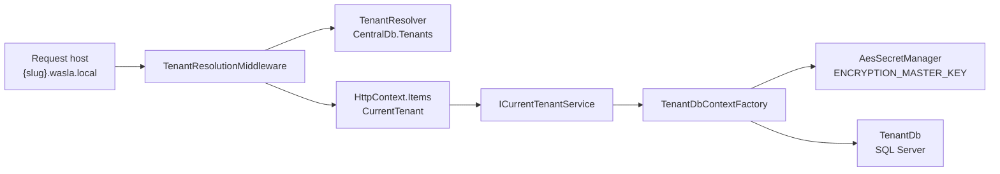

# Tenancy

## Purpose and scope

This document describes how Wasla isolates restaurant SaaS accounts (tenants) across CentralDb, per-tenant databases, host resolution, and connection-string handling.

It owns:

- Central registry vs tenant operational data
- Host/domain resolution and `CurrentTenant`
- `TenantDbContextFactory` and encrypted connection strings
- Provisioning / deletion / reset boundaries

It does not own authentication cookies/schemes (see [authentication.md](authentication.md)) or UI role matrices (see [roles-and-permissions.md](../product/roles-and-permissions.md)). Terminology lives in [terminology.md](../product/terminology.md).

## Current model

A tenant represents one independently operated restaurant location in the current architecture. That location has its own tenant database, orders, Live Screen, platform connections, provider store identifiers, Print Bridge setup, operational settings, and users.

Wasla uses **CentralDb + one physical database per tenant**. It does **not** use shared-schema multi-tenancy. Businesses operating multiple restaurant locations currently use separate tenants for those locations. Tenant remains the data-isolation boundary and the operational boundary. A grouping above tenants is not implemented; see [Future multi-location direction](#future-multi-location-direction).

### Agent warnings

Future agents must **not**:

- Recreate `CustomerDbContext`, `CurrentCustomer`, or similar renamed-away types for new work
- Provision, create, migrate, or drop tenant databases from request middleware or tenant resolution
- Treat CentralDb as a shared operational store for orders
- Document shared-schema multi-tenancy as the Wasla model
- Model extra restaurant locations as extra `StoreId`s or extra same-platform connections inside one tenant
- Add `BranchId` to orders, platform connections, print jobs, settings, or Live Screen to represent those locations

## CentralDb

**Source:** `src/Wasla.Infrastructure/Persistence/Central/CentralDbContext.cs`

CentralDb is the central registry. Connection is a static config connection string (`ConnectionStrings:CentralDb`), not per-request decrypted.

Main `DbSet` entities:

| Entity | Role |
|--------|------|
| `Tenant` | One restaurant location: registry row, database, and operational boundary |
| `TenantMembership` | Central membership links |
| `CentralAdminUser` | Central admin operators |
| `PendingRegistration` | Signup / payment / provisioning pipeline |
| `PrintBridgeDevice` / `PrintBridgeSetupSession` | Print Bridge device registry (central) |
| Address/catalog helpers | `BusinessType`, `Country`, `City`, `District`, `Neighborhood`, `Street`, and related pending-registration join |

### Tenant registry entity

**Source:** `src/Wasla.Domain/Entities/Central/Tenant.cs`

Current implementation stores, among other fields:

- `Name`, `Slug`, `PrimaryDomain`
- `DatabaseName`
- `EncryptedConnectionString` (AES-256-GCM Base64; never log)
- `EncryptionKeyVersion`
- `SchemaVersion`, migration metadata
- `IsActive`
- Billing / provisioning / subscription status enums

Resolution looks up by `PrimaryDomain` (case-normalized) and requires `IsActive`.

## Database-per-tenant

**Source:** `src/Wasla.Infrastructure/Persistence/Tenant/TenantDbContext.cs`

Each active tenant has a dedicated SQL Server database holding operational data (orders, users, platform connections, print jobs, settings, etc.).

`TenantDbContext` is created through `ITenantDbContextFactory` / `TenantDbContextFactory`, not via a single shared connection for all tenants.

Domain types for tenant-DB entities still live under the legacy namespace `Wasla.Domain.Entities.Customer` (for example `Order`, `PlatformConnection`). That namespace is historical; it does **not** mean CentralDb `Customer` still exists. The central SaaS entity is `Tenant`.

## Host / domain resolution

### Resolver

**Source:** `src/Wasla.Infrastructure/Tenant/TenantResolver.cs`

- Input: request host
- Lookup: `CentralDb.Tenants` where `PrimaryDomain` matches (lowercased) and `IsActive`
- Result: `ResolvedTenantDto` (Id, Name, Slug, PrimaryDomain)
- In-resolver cache TTL: **5 minutes** (`tenant:{host}`)

### Web middleware

**Source:** `src/Wasla.Web/Middleware/TenantResolutionMiddleware.cs`

- Cache TTL: **5 minutes** (`tenant:{host}`)
- Sets `HttpContext.Items["CurrentTenant"]` to `ResolvedTenantDto`
- Bypass prefixes include `/admin`, `/signup`, `/checkout`, static assets, `/api/print-bridge`, health/swagger, and several public status/access pages
- Central/public hosts (`localhost`, marketing base domain, `www.{domain}`, raw IPs) skip tenant resolution for normal public routes; `/auth` on a central host redirects to tenant-address guidance
- Tenant hosts are `{slug}.{MarketingBaseDomain}` (development marketing domain is typically `wasla.local`)
- If host looks like a tenant host but no tenant exists: checks pending registration, else redirects to tenant-not-found
- Does **not** create databases, run migrations, or provision tenants

### API middleware

**Source:** `src/Wasla.Api/Middleware/TenantResolutionMiddleware.cs`

- Same `Items["CurrentTenant"]` key and **5-minute** host cache
- Bypasses `/swagger`, `/health`, `/api/print-bridge`
- Missing tenant → HTTP 404 `"Tenant not found"` (no pending-registration UX redirects)
- Does **not** provision databases

### CurrentTenant

**Sources:**

- `src/Wasla.Web/Tenant/CurrentTenantService.cs`
- `src/Wasla.Api/Tenant/CurrentTenantService.cs`

Both read `HttpContext.Items["CurrentTenant"]` only. They do not query CentralDb themselves.

Authorization handlers that need tenant scope compare the authenticated `TenantId` claim to this resolved tenant (see authentication / roles docs).

## TenantDbContextFactory and secrets

**Source:** `src/Wasla.Infrastructure/Persistence/Tenant/TenantDbContextFactory.cs`

Current implementation:

1. Loads the `Tenant` row from CentralDb by id
2. Decrypts `EncryptedConnectionString` via `ISecretManager`
3. Builds SQL Server `DbContextOptions` and returns a new `TenantDbContext`
4. Caches options builders per tenant id in-process

**Encryption:** `src/Wasla.Infrastructure/Security/AesSecretManager.cs`

- Master key environment variable name: `ENCRYPTION_MASTER_KEY` (Base64, 32 bytes when decoded)
- Web and API call `AesSecretManager.ValidateMasterKeyOrThrow()` at startup
- Do not log plaintext connection strings, decrypted secrets, or the master key

## Provisioning, deletion, and reset boundaries

### Allowed provisioning paths

Provisioning creates the tenant database and CentralDb registry state. Current shared orchestration:

- `src/Wasla.Infrastructure/Services/PendingRegistrationProvisioningService.cs`
- Invoked by:
  - CLI: `provision-signup-request` (`src/Wasla.Cli/Program.cs`)
  - Central Admin UI: `PendingRegistrationsController.Provision` (`src/Wasla.Web/Areas/Admin/Controllers/PendingRegistrationsController.cs`)
- Related CLI onboarding still uses legacy command names such as `add-customer` (creates registry + DB + first admin)

### Destructive CLI ops (high level)

Legacy CLI command names still say “customer”:

| Command | Intent |
|---------|--------|
| `delete-customer` | Delete central tenant record and drop tenant DB (destructive; requires confirm) |
| `reset-customer-db` | Drop/recreate/migrate one tenant DB; keep CentralDb tenant row (destructive) |
| `migrate-customer` | Apply pending tenant DB migrations for one tenant |

Do **not** opportunistically rename these CLI commands during unrelated feature work.

### What resolution must not do

Tenant resolution (Web or API middleware / `TenantResolver`) must **not**:

- Create or delete SQL databases
- Run EF migrations
- Mark pending registrations as provisioned
- Write encrypted connection strings
- Treat payment success as automatic DB creation

Payment success and provisioning remain separate states (see product signup docs / AGENTS rules). Middleware may redirect to pending-signup UX; it must not perform provisioning.

### Signup and checkout access

A registration ID is not secret: the pending-tenant redirect and `/tenant-not-found?host=` reveal it. So the ID alone grants nothing.

- A successful signup submission is the only place that issues ownership proof: a Data Protection payload bound to that one registration ID, with the registration's expiry, in the HttpOnly, SameSite=Strict, host-only cookie `.Wasla.SignupRegistration` (Secure outside Development). It is never put in a URL. Proofs survive restarts and work across instances only when they share the key ring (`DataProtection:KeyPath`, application name `Wasla`).
- `/signup/pending/{id}` shows the status and tenant address to anyone, and the applicant's details and checkout link only to the proven browser. `/checkout/review` and `/checkout/success` redirect anyone else to that status page. `/checkout/failed` and `/checkout/cancelled` are generic. The pending, review, and success pages are sent with `Cache-Control: no-store`.
- `POST /checkout/cancel/{id}` requires the proof; without it the request gets 404 and nothing changes.
- The payment simulator (`POST /checkout/simulate-success|simulate-failed/{id}`, its buttons, and the "payment will be simulated" note) exists only in Development, and only for the proven browser. Elsewhere the endpoints return 404. There is no real payment integration yet.
- Every POST validates the antiforgery token. Status changes are compare-and-set on the status that request read, so a concurrent payment, failure, or cancellation is never overwritten (`PendingRegistrationService`).

**Sources:** `src/Wasla.Web/Security/SignupRegistrationOwnership.cs`, `src/Wasla.Web/Controllers/SignupController.cs`, `src/Wasla.Web/Controllers/CheckoutController.cs`, `src/Wasla.Infrastructure/Services/PendingRegistrationService.cs`, tests in `tests/Wasla.UnitTests/Signup/`.

## Platform connections (tenant DB)

Each tenant may have at most one `PlatformConnection` per platform. A second Trendyol GO connection for the same tenant is rejected even when the second row would use a different `StoreId`. Deactivating a connection does not allow another row for that platform. Different platforms may each have one connection. Different tenants have their own databases, so the limit is per tenant.

`StoreId` identifies that tenant's location in the external provider. It is provider configuration, not part of `PlatformConnection` uniqueness, and not how Wasla models multiple physical restaurants. The tenant database enforces one row per platform with unique index `IX_PlatformConnections_Platform`. That index is not filtered by `IsActive`, so a deactivated connection still reserves the platform. `Platform` is immutable after the row is created: an update that posts a different platform is rejected and does not change the stored row. `PlatformConnectionService` rejects a duplicate platform on create.

**Sources:**

- Entity: `src/Wasla.Domain/Entities/Customer/PlatformConnection.cs`
- Service duplicate check: `src/Wasla.Infrastructure/Services/PlatformConnectionService.cs`
- EF config / snapshot: `src/Wasla.Infrastructure/Persistence/Tenant/Configurations/TenantDbConfigurations.cs`, `TenantDbContextModelSnapshot.cs`

## Future multi-location direction

Today, one tenant corresponds to one independently operated restaurant location. A business with multiple locations uses separate tenants. A future organization/branch layer may group those tenants for centralized management while preserving tenant database and operational isolation.

That grouping is not implemented. No organization or business-account entity exists. Cross-location dashboards, billing, location switching, and reporting are not current functionality.

Do not model those locations by adding a second `PlatformConnection` for the same platform, and do not add `BranchId` onto orders, platform connections, print jobs, settings, or Live Screen.

## Current Branch record

The tenant database has a `Branch` row with name, address, and an active flag, edited at `/branches`. `AppUser` has an optional `BranchId`. Orders, platform connections, print jobs, and Live Screen do not use that field. The entity comment describes a physical location; that comment is not the multi-location architecture above. Do not extend `Branch` into a second restaurant inside the tenant.

## Cache TTL summary

| Location | Key pattern | TTL |
|----------|-------------|-----|
| `TenantResolver` | `tenant:{host}` | 5 minutes |
| Web `TenantResolutionMiddleware` | `tenant:{host}` | 5 minutes |
| API `TenantResolutionMiddleware` | `tenant:{host}` | 5 minutes |

## Related docs

- [authentication.md](authentication.md)
- [terminology.md](../product/terminology.md)
- Stale historical notes in `docs/tenant-vs-customer.md` (do not copy its outdated `Customer.cs` / `CustomerDb` paths; central entity is `Tenant`, operational context is `TenantDbContext`)
